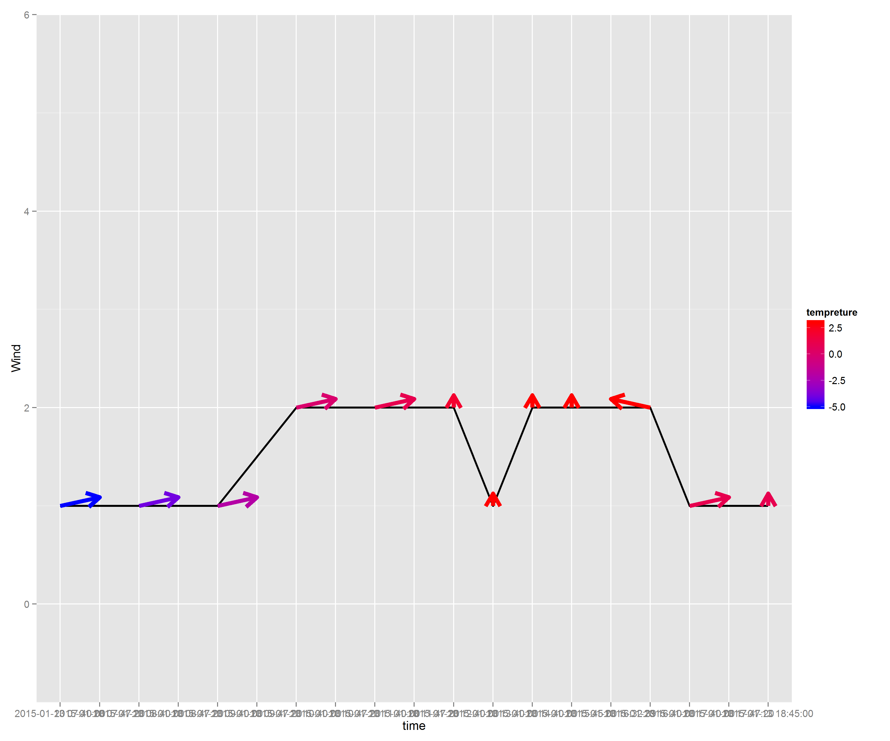

Weather Data Explorer
========================================================
author: Borye
date: Tue Jan 20 12:26:58 2015
transition: rotate

The Application
========================================================
type: sub-section

**Weather Data Explorer** is a shiny web application which based on 
the weather data from China in *2015-01-13* one day. 

This application will allows the user to:

- Choose a province in China, and select a time range within one day. 
- Display the province location in a map from China
- Shows the weather condition like tempreture or wind level of the capital city of that province

Example Code
========================================================
type: sub-section
id: slide3

This is a example code for plot Wind level and Wind direction in *Beijing* from *07:00* to *19:00*, 2015-01-13


```r
ggplot(data = dat, aes(x = time, y = WSE)) +
      geom_line(size = 1) + 
      geom_segment(data 
      = dat, size = 2, aes(x = time, xend = 
      x.end, y = WSE, yend = y.end, color = 
      tempreture), arrow = arrow(length = 
      unit(0.5, "cm"))) + 
      scale_colour_gradient(low="blue", 
      high="red") + coord_cartesian(ylim = 
      c(-1, 6)) + theme_set(theme_bw()) + 
      labs(x = "time", y = "Wind")
```

Example Plot
========================================================
type: sub-section
[Go back to code](#/slide3)

 

Further Information
========================================================
type: sub-section

This application is builded using **shiny** and is published on **shinyapps**. To browse this please click on [link](https://borye.shinyapps.io/Weather_Data_Explorer/)

The source code of this application can be found at [GitHub](https://github.com/Borye/Weather_Data_Explorer)
